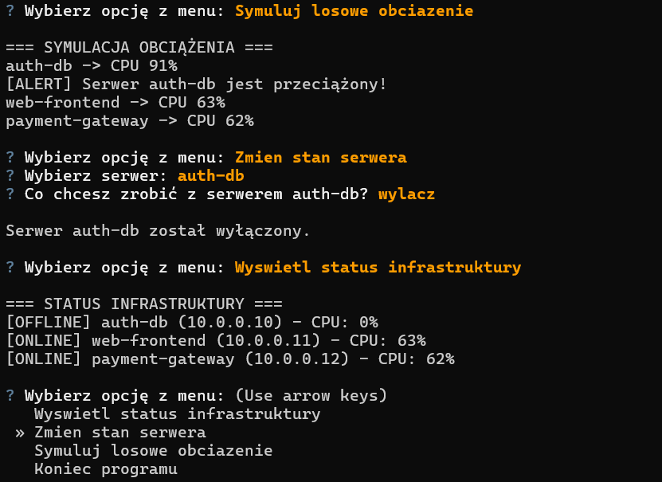

# Data Center Simulator (Python OOP & Interactive CLI)

Interaktywny symulator centrum danych napisany obiektowo (OOP) w Pythonie, umożliwiający zarządzanie stanem wirtualnych serwerów oraz monitorowanie ich parametrów w czasie rzeczywistym. Program wykorzystuje bibliotekę `questionary` do stworzenia nowoczesnego interfejsu CLI, oferując funkcje dymaicznej zmiany statusów maszyn (ONLINE/OFFLINE) oraz losowej symulacji obciążenia procesora (CPU) wraz z systemem alertów o przeciążeniach.

## Podgląd działania programu

